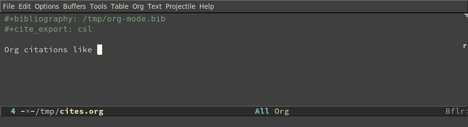

# org-cite-csl-activate



An experimental CSL-based activation processor for Org citations, which
fontifies citations using rendered previews generated by `citeproc-el`. In
addition, tooltips over citations show a ’mini bibliography’ of the items
referred to.

## Requirements

+ Org 9.5 or later.
+ The [citeproc-el](https://github.com/andras-simonyi/citeproc-el) library.

## Installation

Drop `oc-csl-activate.el` somewhere on your load path.

## Setup

The library requires `cursor-sensor-mode` to be turned on in the Org buffer in
which citations should be rendered, and the provided activation processor should
be selected by executing

``` emacs-lisp
(require 'oc-csl-activate)
(setq org-cite-activate-processor 'csl-activate)
```

This causes _edited_ Org citations with valid cite keys to be rendered
immediately when the cursor leaves them, but unedited citations remain
unrendered. The interactive command

``` emacs-lisp
org-cite-csl-activate-render-all
```

in contrast, renders all Org citations in the current buffer.

One way of making sure that `cursor-sensor-mode` is turned on is adding the
corresponding command to `org-mode-hook`:

``` emacs-lisp
(add-hook 'org-mode-hook (lambda () (cursor-sensor-mode 1)))
```

The command `org-cite-csl-activate-render-all` can also be added to
`org-mode-hook` to render all citations upon opening an Org document but this
can slow down opening documents with a large number of citations; see the last
section for some (anecdotical) details.

## Customization

Citations and the associated ’mini bibliographies’ are rendered in the default
CSL style and locale by default (typically, Chicago author-date and en_US), but this can be changed
by setting the variables `org-cite-csl-activate-use-document-style`and `org-cite-csl-activate-use-document-locale` variable to non-nil values:

``` emacs-lisp
(setq org-cite-csl-activate-use-document-style t)
(setq org-cite-csl-activate-use-document-locale t)
```

in which case the CSL style and locale (org `#+lang:` keyword) set in the document is used.

> :warning: **Warning:** Setting this variable to non-nil when a CSL style which doesn’t belong to the `author-date` category is used will almost certainly cause rendering problems.

## Known bugs and limitations
This is mostly untested code, you will most probably encounter some problems and
glitches. In particular,

+ deleting citations when the cursor positioned _after_ the citation behaves
  weirdly, because the rendered citation is not removed and the user is unable
  to see what is happening under the replaced text until everything gets deleted;
+ citation rendering is not disambiguated (only within the same citation);
+ rendering a large number of citations using `org-cite-csl-activate-render-all`
  may be slow, my (old) laptop renders approximately 150 citations per second on
  average.


